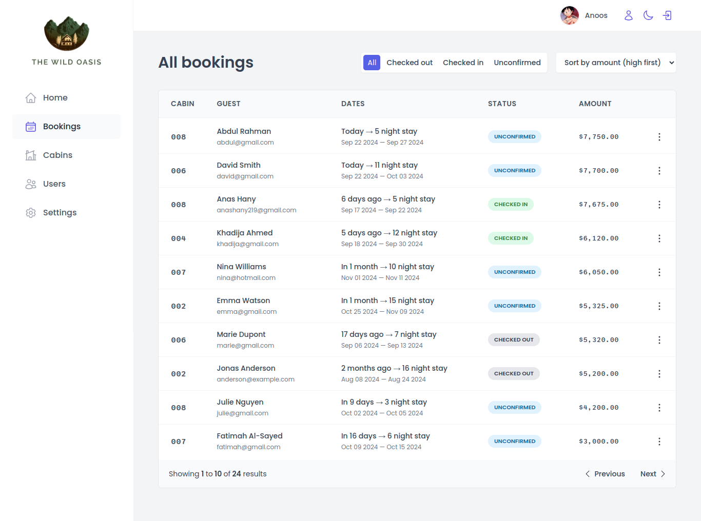
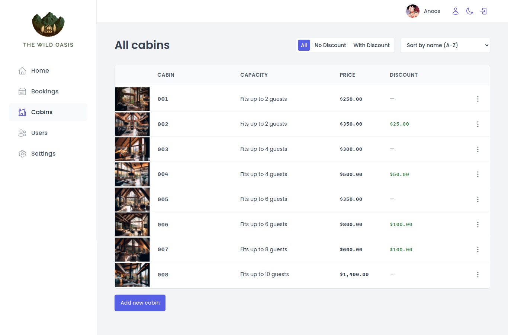
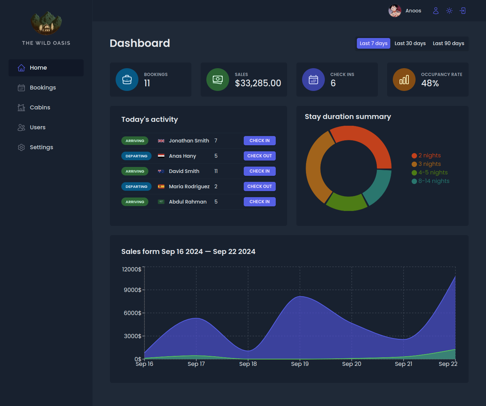
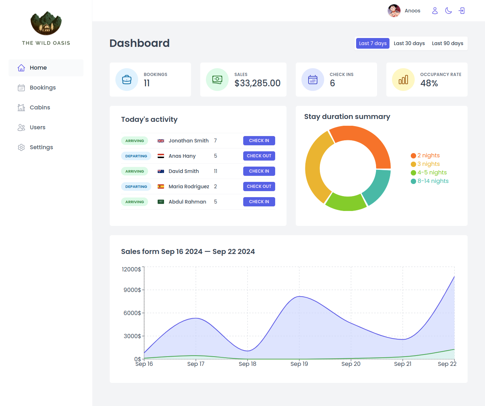

# 🏕️ The Wild Oasis

Welcome to **The Wild Oasis**, a full-featured cabin management app for managing bookings, cabins, and much more! This project integrates **Supabase** for backend services, **React Query** for data fetching, and a responsive design that supports both **dark** and **light modes**.

🚀 **Live Demo**: [The Wild Oasis](https://the-wild-oasis-2193.netlify.app/)

## 🌟 Features

- 🏕️ **Cabin Management**: Add, edit, and manage cabins.
- 📅 **Booking Management**: View, create, and manage bookings.
- 📈 **Dashboard**: Visualize statistics using **Recharts**.
- 🌙 **Dark Mode**: Switch between dark and light themes.
- 🔐 **Authentication**: Secure login and user management with **Supabase**.
- 🔄 **Real-time Updates**: Data fetching and synchronization using **React Query**.

## 📸 Screenshots

### 🗂️ All Bookings



### 🏕️ All Cabins



### 🌙 Dark Mode Dashboard



### ☀️ Light Mode Dashboard



## ⚙️ Technologies Used

- **React**: Frontend framework
- **Supabase**: Backend services (authentication, database, storage)
- **React Query**: Data fetching and state management
- **Styled Components**: CSS-in-JS for styling
- **Recharts**: Data visualization library
- **React Hook Form**: Form management
- **React Router**: Client-side routing

## 🚧 Installation & Setup

To run this project locally, follow these steps:

1. **Clone the repo**:

   ```bash
   git clone https://github.com/AnasHany2193/The-Wild-Oasis.git
   cd The-Wild-Oasis
   ```

2. **Install dependencies**:

   ```bash
   npm install
   ```

3. **Start the development server**:

   ```bash
   npm run dev
   ```

## 🙌 Contributing

Feel free to contribute to this project by submitting issues or pull requests. Let's make **The Wild Oasis** even better together! 💪

---

Made with ❤️ by [Anas Hany](https://www.linkedin.com/in/anashany2193/) 🌍
